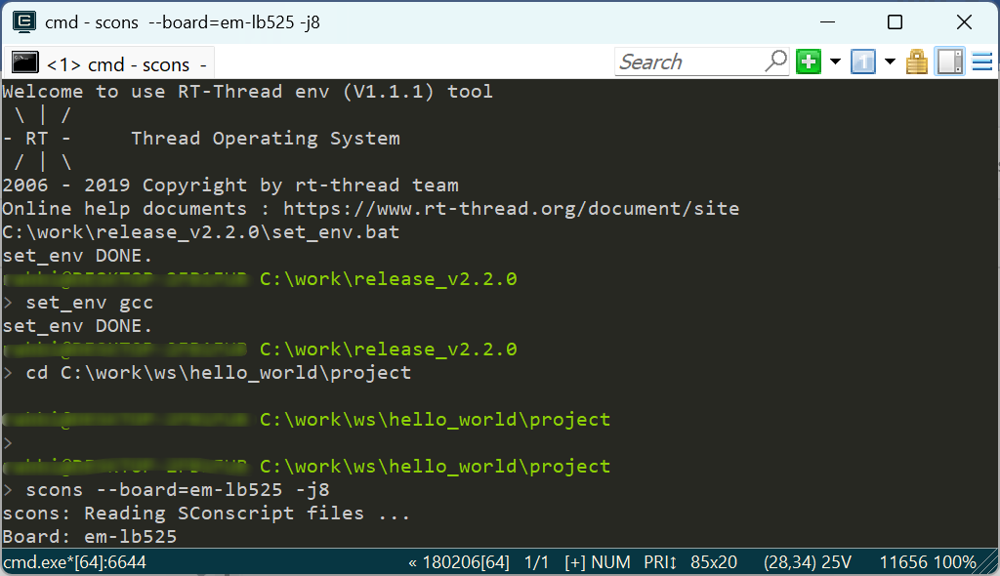

# Creating an Application

The fastest way to create an application is to copy an existing example. Below, we will explain how to create a new application based on the `hello_world` example.

## Copy the Example

1. Copy the example: Copy the `example/get-started/hello_world/rtt` directory to any desired location, such as `c:\work\ws\hello_world`.

    ```{image} ../../assets/app_folder.png
    :scale: 70%
    ```

    The directory structure of the application:

    ```none
    +---project                // Project directory
    |       Kconfig
    |       Kconfig.proj
    |       proj.conf          // Project configuration file
    |       rtconfig.py
    |       SConscript
    |       SConstruct         
    |       
    \---src                    // Source code directory
            main.c
            SConscript
    ```

2. Open the Env command line window: Right-click on the SDK root directory and open the Env command line window, then run `set_env gcc` to set the environment parameters.
3. Change to the project directory: `cd c:\work\ws\hello_world\project` to switch to the copied example project directory.
4. Compile: `scons --board=sf32lb52-lcd_n16r8 -j8`. The selected board is `sf32lb52-lcd_n16r8`, refer to [supported_boards/index.md](../supported_boards/index.md).
    
    `
5. Flash: `build_sf32lb52-lcd_n16r8_hcpu\uart_download`.

At this point, a new `hello_world` program has been created, and the compilation and flashing methods for the new project are identical to those of the SDK’s built-in examples.

## Modify the Code

The application code for `hello_world` is in the `src/main.c` file, where you can see that it prints "Hello world" only once on line 5.

{lineno-start=1}
```c
int main(void)
{
    rt_thread_mdelay(3000);      
    /* Output a message on console using printf function */
    rt_kprintf("Hello world!\n");

    /* Infinite loop */
    while (1)
    {
    }
    return 0;
}
```

Now, add the following two lines between lines 10 and 11 to print "Hello SiFli" every 3 seconds.

{lineno-start=1 emphasize-lines="10,11"}
```c
int main(void)
{
    rt_thread_mdelay(3000);         
    /* Output a message on console using printf function */
    rt_kprintf("Hello world!\n");

    /* Infinite loop */
    while (1)
    {
        rt_kprintf("Hello SiFli!\n");
        rt_thread_mdelay(3000);  
    }
    return 0;
}
```

After modifying the code, compile and download the program. Connect the serial port debugging tool, reset the device, and you will see the printed output as shown in the image.

```{image} ../../assets/print_log.png
:scale: 70%
```

In addition to adding code in `main.c`, you can also add C files in the `src` directory. Since the `SConscript` in the `src` directory already uses the `Glob` command to include all C files in the current directory for compilation, you can simply add your new C files. For more details on using Scons scripts, refer to [SCons.md](../app_note/scons.md).

```python
import os
from building import *

# Add source code
src = Glob('*.c')
group = DefineGroup('Applications', src, depend = [''])

Return('group')
```

## Modify Settings

The `hello_world` example only has basic print functionality, and many components are not enabled. Even if you include the headers for these components in `main.c`, their corresponding functions cannot be called unless you modify the project configuration using the `menuconfig` tool.

To modify the configuration, run `menuconfig --board=<board_name>` in the project directory. Replace `<board_name>` with the name of the board you are using, such as `menuconfig --board=sf32lb52-lcd_n16r8`. This is similar to specifying the board during `scons` compilation. By default, `hcpu` is used, meaning that `menuconfig --board=sf32lb52-lcd_n16r8` and `menuconfig --board=sf32lb52-lcd_n16r8_hcpu` will have the same effect, both configuring the current project for the `sf32lb52-lcd_n16r8` board's HCPU.

After executing `menuconfig`, a screen like the following will appear. You can use the {kbd}`⇧` and {kbd}`⇩` arrow keys to navigate between menu items, press {kbd}`Enter` to enter submenus, and press {kbd}`Space` to select menu items. Once all changes are complete, press {kbd}`D` to save the minimal configuration to the `proj.conf` file in the project directory (`project\proj.conf`). This file is a text file and can be opened to view the differences before and after modifications. For detailed usage of `menuconfig`, refer to [menuconfig.md](../app_note/menuconfig.md).

`

For more detailed information on configuration and compilation mechanisms, please read [build_and_configuration.md](build_and_configuration.md).
