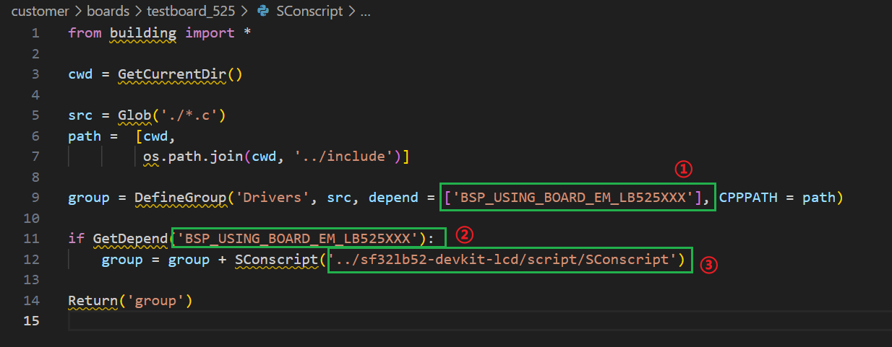

# Creating a Board

The fastest way to create a new board is to modify an existing board with similar hardware configuration. In this example, we will create a new board based on the `sf32lb52-lcd_n16r8` (i.e., `sf32lb52-devkit-lcd`) board. The new board uses the SF32LB525 chip and has an external NOR Flash, so starting with the `sf32lb52-lcd_n16r8` board is a good choice.

The steps are as follows:

1. Create a folder `testboard_525` under the `boards` directory and copy the files from `sf32lb52-lcd_n16r8` to `testboard_525`.

2. Create a folder `testboard_525_base` under the `boards` directory and copy the files from `sf32lb52-devkit-lcd` to `testboard_525_base`.

3. Modify `testboard_525/SConscript`, changing the macro names in locations 1 and 2 to the new board's name, and change the SConscript file path referenced in location 3 to `testboard_525_base`.

    `

    The modified code looks like this:

    

4. Modify the board macros in `testboard_525/hcpu/Kconfig.board` and `testboard_525/lcpu/Kconfig.board` to match the names from the previous step. The modified code is as follows:
    ```{code-block} kconfig
    :caption:   hcpu/Kconfig.board
    
    config BSP_USING_BOARD_TESTBOARD_525
        bool
        select SOC_SF32LB52X
        select BF0_HCPU
        default y
    
    rsource "../Kconfig.board"
    ```

    ```{code-block} kconfig
    :caption:    lcpu/Kconfig.board
    
    config BSP_USING_BOARD_TESTBOARD_525
        bool
        select SOC_SF32LB52X
        select BF0_LCPU
        default y
    
    rsource "../Kconfig.board"
    ```

5. Modify `testboad_525/Kconfig.board` to reference the `Kconfig.board` from `testboard_525_base`:
    ```kconfig
    source "$SIFLI_SDK/customer/boards/testboard_525_base/Kconfig.board"
    ```

6. At this point, a new board has been created. You can switch to `hello_world/rtt/project` and run the following command to compile using the new board:
    ```none
    > scons --board=testboard_525 -j8
    scons: Reading SConscript files ...
    Board: testboard_525_hcpu
    ========
    Multi-Project Info
    --------
    full_name       main.bootloader
    parent          main
    bsp_root        D:\code\release_v2.3\release_v2.3.0_test\example\boot_loader\project\butterflmicro\ram_v2
    build_dir       build_testboard_525_hcpu/bootloader
    link_script     D:/code/release_v2.3/release_v2.3.0_test/example/boot_loader/project/butterflmicro/ram_v2\link
    ptab            D:/code/release_v2.3/release_v2.3.0_test/customer/boards/testboard_525\ptab.json
    embedded:       False
    --------
    full_name       main
    parent
    bsp_root        D:\code\release_v2.3\release_v2.3.0_test\example\get-started\hello_world\rtt\project
    build_dir       build_testboard_525_hcpu/
    link_script     D:/code/release_v2.3/release_v2.3.0_test/drivers/cmsis/sf32lb52x/Templates/gcc/HCPU/link
    ptab            D:/code/release_v2.3/release_v2.3.0_test/customer/boards/testboard_525\ptab.json
    --------
    full_name       main.ftab
    parent          main
    bsp_root        D:\code\release_v2.3\release_v2.3.0_test\example\flash_table\sf32lb52x_common_v2
    build_dir       build_testboard_525_hcpu/ftab
    link_script     D:/code/release_v2.3/release_v2.3.0_test/drivers/cmsis/sf32lb52x/Templates/gcc/HCPU/link
    ptab            D:/code/release_v2.3/release_v2.3.0_test/customer/boards/testboard_525\ptab.json
    embedded:       False
    ========
    ```

## Board Directory Structure

The directory structure for the board is as follows:

```{code-block} none
:caption: testboard_525

|   Kconfig.board          // Board's Kconfig configuration file
|   ptab.json              // Memory partition table
|   SConscript             // Build script
|   
+---hcpu
|       board.conf         // HCPU minimum configuration file generated by menuconfig
|       custom_mem_map.h   // Used when CUSTOM_MEM_MAP is enabled, for custom memory mapping
|       Kconfig            
|       Kconfig.board      // HCPU's Kconfig configuration file, can source the parent directory's `Kconfig.board`
|       rtconfig.py        // Can specify JLINK_DEVICE, used when generating the download script
|       
\---lcpu    
        board.conf         // LCPU minimum configuration file generated by menuconfig
        custom_mem_map.h
        Kconfig
        Kconfig.board
        rtconfig.py
```

```{code-block} none
:caption: testboard_525_base

|   board.h
|   bsp_board.h
|   bsp_init.c        // Implementation of HAL_PreInit
|   bsp_lcd_tp.c      // IO-related configuration code
|   bsp_pinmux.c      // IO-related configuration code
|   bsp_power.c       // IO-related configuration code
|   Kconfig.board     // Board's Kconfig configuration file
|   
\---script
        SConscript
```

The `testboard_525_base` directory is separated to improve code reuse. A single board might have several variants (e.g., using different chips), and by referencing `testboard_525_base`, multiple boards can be created without duplicating modifications. If there are no variants for the board, the files in `testboard_525_base` can be merged directly into `testboard_525` by adjusting the file references.

## Modify Board Configuration

The board configuration includes several aspects:

1. Hardware connections are defined in files such as `bsp_pinmux.c`, `board.conf`, and `Kconfig.board`.
    - `board.conf` stores options configurable via `menuconfig`, such as the serial port used for the console. To modify, run `menuconfig` in the directory where `board.conf` is located and press {kbd}`D` to save the minimal configuration.
    - `Kconfig.board` stores options not visible in `menuconfig`, such as pin assignments for touch interrupts, PWM device numbers for backlight, etc.
        ```kconfig
        config ASIC
            bool 
            default y 
        
        config TOUCH_IRQ_PIN
            int
            default 26
        
        config LCD_PWM_BACKLIGHT_INTERFACE_NAME
            string
            default "pwm3"
        
        config LCD_PWM_BACKLIGHT_CHANEL_NUM
            int
            default 4
        
        config LCD_BACKLIGHT_CONTROL_PIN
            int
            default 1
        
        config RGBLED_CONTROL_PIN
            int
            default 32  
        ```
    - Files like `bsp_pinmux.c` configure pin functions and pull-up/down properties through functions such as `BSP_PIN_Init` and the `HAL_PIN_Set` interface.

2. Memory partition table (`ptab.json`): This file describes the memory partitioning information, including NOR Flash, NAND Flash, PSRAM, internal SRAM, SD cards, etc. During compilation, `ptab.json` generates a `ptab.h` file in the build directory, which defines macros like `_START_ADDR`, `_OFFSET`, and `_SIZE` for each partition. These macros can be used in the code to access partition information.

For more information, refer to [common_project.md](../app_note/common_project.md).
