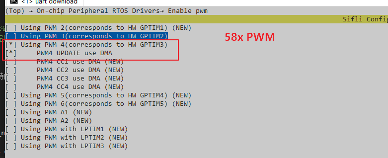
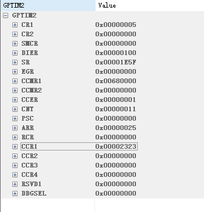

# RGBLED Example

Source path: example/rt_device/rgbled

## Supported Platforms
<!-- Which boards and chip platforms are supported -->
+ sf32lb52-lcd_n16r8
+ sf32lb58-lcd_n16r64n4
## Overview
<!-- Example introduction -->
This example demonstrates rgbled driver based on rt-device (using rt-thread), including:
+ rgb_ cycling RGB light display;

```{tip}
This example is based on HCPU and uses PWM DMA driver.
```

## Example Usage
<!-- Explain how to use the example, such as which hardware pins to connect to observe waveforms, compilation and flashing can reference related documentation.
For rt_device examples, you also need to list the configuration switches used by this example, such as PWM example using PWM1, which needs to be enabled in the onchip menu -->

### Hardware Requirements
Before running this example, you need to prepare a development board supported by this example

### menuconfig Configuration

Run the following command
```c
menuconfig --board=sf32lb52-lcd_n16r8
```
Enable PWM， 52x use PWM3 CHANNLE1, 58x use  PWM4 CHANNLE4<br>  
<br>
<br>

Enable RGBLED peripheral and corresponding peripheral pwm, Channel<br>
<br>
<br>

**Note**: pwm setting already sets TIM configuration, check if Enable timer configuration causes conflicts


Similar conflict error:


Error from different pwm channel and rgb configuration:


### Compilation and Programming
Switch to the example project directory and run the scons command to execute compilation:
```
scons -j8 --board=sf32lb52-lcd_n16r8 
```
Run `build_sf32lb52-lcd_n16r8_hcpu\uart_download.bat`, select the port as prompted to download:
```
$ ./uart_download.bat

     Uart Download

please input the serial port num:5
```
For detailed steps on compilation and downloading, please refer to the relevant introduction in [](/quickstart/get-started.md).

## Expected Results
<!-- Explain the example running results, such as which LEDs will light up, what logs will be printed, so that users can judge whether the example is running normally. The running results can be explained step by step combined with the code -->
After the example starts, the serial port cyclically outputs color characters, and the hardware rgbled also displays corresponding colors:
```
12-25 11:51:46:770    start display color!
12-25 11:51:47:266    -> black
12-25 11:51:49:261    -> blue
12-25 11:51:50:257    -> green
12-25 11:51:51:264    -> cyan
12-25 11:51:51:283    -> red
12-25 11:51:52:262    -> purple
12-25 11:51:54:278    -> yellow
12-25 11:51:55:275    -> white

```


## Exception Diagnosis

1. Confirm PWM/DMA configuration status through PWM/DMA registers:
2. Enable rgb configuration error

GTIM2 register status:

DMAC1 register status:


## Reference Documentation
<!-- For rt_device examples, the RT-Thread official website documentation provides more detailed explanations, you can add webpage links here, for example, refer to RT-Thread's [RTC documentation](https://www.rt-thread.org/document/site/#/rt-thread-version/rt-thread-standard/programming-manual/device/rtc/rtc) -->

## Update Log
|Version |Date   |Release Notes |
|:---|:---|:---|
|0.0.1 |12/2024 |Initial version |
| | | |
| | | |